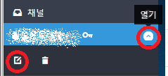
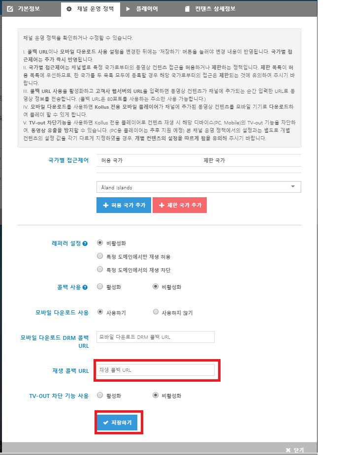

kollus-sample-java
==================

Description
-
Kollus와의 연동을 위한 Java 기반의 예제를 실행할수 있는 프로젝트입니다. 

적용 예제는 다음과 같습니다.
>
0. One Page Test --> 아래의 모든 기능을 한페이지에서 실행해 볼수 있습니다.
1. Web Token 생성 및  디코딩
2. HTTP Endpoint Upload
3. Video Gateway Query String 생성기
4. Player Controller for javascript
5. Play Callback
6. DRM Callback
7. LMS Callback

Callback Configuration in CMS
-
0. Kollus CMS (http://kr.kollus.com)에 방문하신후 로그인 해주십시요.
1. 상단 [채널] 메뉴를 클릭하면 좌측에 생성하신 채널명이 보이실겁니다.
2. 채널명 우측으로 마우스를 가져다 놓았을때 열기 버튼이 보이고 클릭을 하시면 채널명 하단에 채널 정책을 설정할수 있는 버튼이 나오게 됩니다.

3. 버튼을 클릭하시면 아래와 같은 창이 나오게 되고 [채널 운영 정책] 메뉴를 선택해 주시기 바랍니다.
4. 아래의 빨간색으로 표시되어 있는 [재생 콜백 URL] 을 지정 해주시고 [저장하기]를 클릭 하여 주시면 됩니다.
 ※ 콜백 URL은 콜백의 응답을 해주는 서버의 주소입니다. 예를 들어 http://localhost/callback 이런식으로 해주시면 됩니다.

Runtime Environment
-
>
- JDK 1.8
- Maven 3.2.3

Configuration Files
-
>
* /src/main/webapp/files/user.properties : Kollus 계정정보 파일
* /src/main/webapp/files/policy/default.json : Kollus callback 정책 설정 파일

How to run
-
embeded-tomcat 8.0 이 구성이 되어 있어 따로 웹서버를 구성하실 필요가 없습니다.

    $ git clone https://github.com/kollus-service/kollus-sample-java.git
    $ mvn package
    $ cd target/bin

- Linux or MacOSX

    $  ./kollus-sample-java
    
- Windows

    $ kollus-sample-java.bat

- Browser
> http://localhost

Cautions
-
> * 다른 어플리케이션에서 80번 포트를 이용할 경우 충돌이 일어날수 있습니다.

